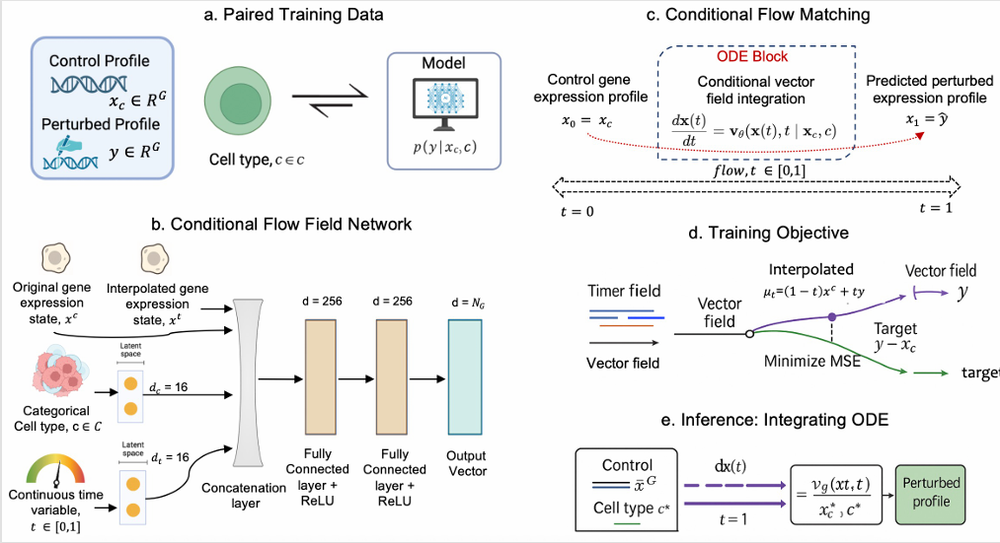

# CFM-GP: Unified Conditional Flow Matching to Learn Gene Perturbation Across Cell Types

##  Overview

Understanding gene perturbation effects across diverse cellular contexts is a central challenge in functional genomics, with significant implications for therapeutic discovery and precision medicine. While single-cell technologies enable high-resolution measurement of transcriptional responses, collecting such data remains expensive and time-intensive, especially when repeated for each cell type. Existing computational methods attempt to predict these responses but typically require separate models per cell type, limiting scalability and generalization.

CFM-GP (**C**onditional **F**low **M**atching for **G**ene **P**erturbation) is a novel deep learning framework that learns a continuous, time-dependent transformation between unperturbed and perturbed gene expression distributions, conditioned on cell type. This allows a single model to predict the transcriptional effect of a perturbation across all cell types, eliminating the need for cell type–specific training. CFM-GP employs the **flow matching objective** to model perturbation dynamics in a scalable manner.

##  Key Features

- **Cell Type–Agnostic Prediction**: Learns perturbation effects across all cell types via a single model, with no need for cell type–specific retraining.
- **Continuous Trajectory Modeling**: Utilizes a novel vector field formulation to learn time-dependent perturbation trajectories, conditioned on both cell identity and time.
- **Generalization Across Contexts**: Capable of transferring perturbation knowledge across domains, including across species boundaries.
- **Biological Fidelity**: Accurately recovers pathway activity as confirmed by pathway enrichment analysis.


## CFM-GP Framework


##  Installation and Environment Setup

```bash
git clone https://github.com/abrarrahmanabir/CFM-GP.git
cd CFM-GP
pip install -r requirements.txt

```

## 📂 Dataset Access

The five fully processed datasets used in this study can be downloaded from the following Google Drive link:

👉 [CFM-GP Dataset (Google Drive)](https://drive.google.com/file/d/1sJxHM4te1CNShBLUrLVEGPrkEbOjM7mk/view?usp=sharing)

After downloading, extract the contents and place them under the following directory:

```
./data/
```
This folder will contain all necessary files required to train and evaluate CFM-GP.


## Running Inference

Once the environment is set up and dependencies are installed, you can run inference using our trained models provided in `./model/` directory. We have provided a bash script containing all the necessary commands to run inference for all five datasets. After running, the results will be saved in `<dataset>_results` directory, which will contain three CSV files containing R squared value, MMD and Spearman's rank correlation coefficient for each cell type.

```bash
bash test_script.sh 
```

---

## Training Instructions

To train CFM-GP from scratch for all the datasets, run the following command. This will save the trained models in `./model/` directory.

```bash
bash train_script.sh
```


---


