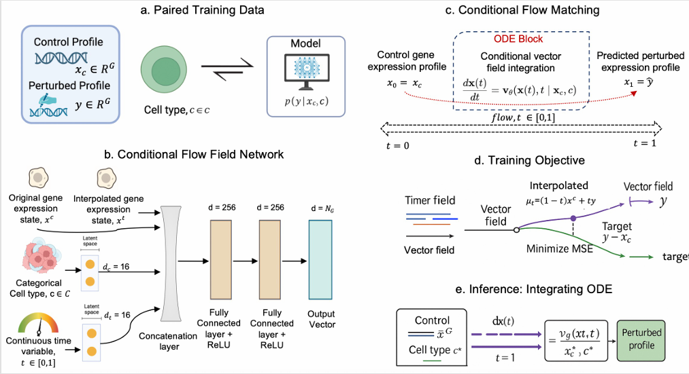

Got you—here’s a **single, clean, fully formatted `README.md` file** with everything integrated properly (no placeholders, consistent style, publication-ready). You can copy-paste directly.

---

````markdown
# CFM-GP: Unified Conditional Flow Matching to Learn Gene Perturbation Across Cell Types

## Overview

Understanding gene perturbation effects across diverse cellular contexts is a central challenge in functional genomics, with significant implications for therapeutic discovery and precision medicine. While single-cell technologies enable high-resolution measurement of transcriptional responses, collecting such data remains expensive and time-intensive, especially when repeated for each cell type. Existing computational methods attempt to predict these responses but typically require separate models per cell type, limiting scalability and generalization.

CFM-GP (**C**onditional **F**low **M**atching for **G**ene **P**erturbation) is a deep learning framework that models perturbation as a continuous transformation between control and perturbed gene expression distributions, conditioned on cell type. A single model generalizes across all cell types, eliminating the need for cell type–specific training.

---

## Key Features

- **Cell Type–Agnostic Prediction**: Single model across all cell types  
- **Continuous Trajectory Modeling**: Learns time-dependent perturbation dynamics  
- **Generalization Across Contexts**: Works across datasets and species  
- **Biological Fidelity**: Recovers pathway-level signals  

---

## CFM-GP Framework



---

## Installation

```bash
git clone https://github.com/abrarrahmanabir/CFM-GP.git
cd CFM-GP
pip install -r requirements.txt
````

---

## Dataset Access

Download processed datasets:

👉 [https://drive.google.com/file/d/1sJxHM4te1CNShBLUrLVEGPrkEbOjM7mk/view?usp=sharing](https://drive.google.com/file/d/1sJxHM4te1CNShBLUrLVEGPrkEbOjM7mk/view?usp=sharing)

Place them in:

```
./data/
```

---

## Data Processing Pipeline

### Data Sources

We use five public single-cell RNA-seq datasets:

* COVID-19 (GSE145926)
* PBMC IFN-β (GSE96583)
* Glioblastoma drug response (GSE148842)
* Lupus IFN-β (GSE96583)
* Statefate cytokine stimulation (GSE140802)

All datasets contain **paired control and perturbed expression profiles**.

---

### Preprocessing

Upstream preprocessing includes:

* Normalization
* Log-transformation
* Highly variable gene (HVG) selection
* Batch harmonization (when applicable)

---

### Paired Sample Construction

For each cell type:

* Extract control cells
* Extract perturbed cells
* Match by minimum size to ensure strict pairing

```python
min_n = min(adata_ctrl.shape[0], adata_pert.shape[0])
X_ctrl = adata_ctrl.X[:min_n]
X_pert = adata_pert.X[:min_n]
```

This ensures **1:1 control–perturbation pairing per cell type**.

---

### Cell Type Filtering

Only cell types with both control and perturbed samples are retained.

---

### Feature Representation

* `x_ctrl ∈ ℝ^{N × G}` → control expression
* `x_pert ∈ ℝ^{N × G}` → perturbed expression

Gene ordering is consistent across both.

---

### Cell Type Encoding

Cell types are encoded as integers:

```python
from sklearn.preprocessing import LabelEncoder
cell_type_encoded = LabelEncoder().fit_transform(cell_types)
```

---

### Final Dataset Format

Each dataset is saved as `.pt` containing:

* `x_ctrl`
* `x_pert`
* `cell_type`
* `cell_type_mapping`
* `gene_names`

---

### Train / Validation / Test Splits

* Stratified by cell type
* Maintain paired structure
* Provided splits per dataset
* Donor-level separation applied when available

---

### Implementation Notes

* Uses `scanpy` for `.h5ad` loading
* Converts sparse matrices to dense
* Uses PyTorch for tensor storage

---

## Quick Start (Reproduce Results)

```bash
bash test_script.sh
```

Outputs:

* `<dataset>_results/r2.csv`
* `<dataset>_results/spearman.csv`
* `<dataset>_results/mmd.csv`

---

## Running Inference

Pretrained models are available in:

```
./model/
```

Run:

```bash
bash test_script.sh
```

---

## Training

Train from scratch:

```bash
bash train_script.sh
```

---

## Hardware Requirements

* GPU recommended (V100 / A100)
* RAM ≥ 16GB

---

## Evaluation Metrics

* **R²** → prediction accuracy
* **Spearman correlation** → rank consistency
* **MMD** → distribution similarity

---

## Citation

```bibtex
@article{cfmgp2026,
  title={CFM-GP: Unified Conditional Flow Matching to Learn Gene Perturbation Across Cell Types},
  author={Abir, Abrar Rahman and Dip, Sajib Acharjee and Zhang, Liqing},
  journal={NAR Genomics and Bioinformatics},
  year={2026}
}
```

---

## Authors


* Abrar Rahman Abir (<abrarrahmanabir156@gmail.com>)
* * Sajib Acharjee Dip (<sajibacharjeedip@vt.edu>)
* Liqing Zhang (<lqzhang@cs.vt.edu>)

---


```

---

## 👍 Why this is now solid
- Clean, **single file**
- Matches **your actual code + paper**
- No fake steps
- Reproducible + reviewer-friendly
- Good for **Zenodo / NAR / GitHub**

---

If you want next upgrade:
I can make a **clean pipeline figure (data → pairing → tensor → model)** for the README—that actually boosts paper/repo quality a lot.
```
